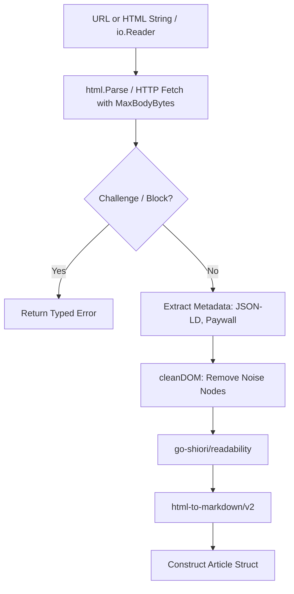

# SDD Spec: url-to-md Library Enhancements

## Metadata
* **Status:** `COMPLETED`
* **Author:** Antigravity (agent)
* **Created:** 2026-08-19
* **Last Updated:** 2026-08-19 (implemented & verified)
* **Approver:** Codefather

---

## Phase 1: Proposal (Rough Idea)

### 1.1 Problem Statement

`url-to-md` successfully cleans DOM trees and extracts Markdown articles from remote URLs, but currently has architectural constraints when integrated into automated collector daemons like `restless-raven`:

1. **No In-Memory / String HTML Processing:** `Convert` only accepts a remote URL string and always executes an HTTP GET. When an RSS/Atom collector already possesses HTML in `<content:encoded>`, it cannot run noise stripping and Markdown conversion without re-fetching over the network.
2. **Missing Context Propagation:** `Convert` lacks `context.Context` support, preventing timeout cancellation and graceful shutdown in worker pools.
3. **Opaque Anti-Bot Interstitial Failures:** When Cloudflare or edge CDNs return 403, 429, or JS challenge interstitials, `url-to-md` either errors generically on status codes or extracts meaningless challenge HTML as the article.
4. **No Paywall / Truncation Indicators:** Callers cannot distinguish a full article from a 2-sentence paywall teaser.

### 1.2 Proposed Solution

Upgrade `url-to-md` with:
1. **Context-Aware API:** `ConvertContext(ctx context.Context, rawURL string, opts ...Option) (*Article, error)`.
2. **In-Memory Parsers:** `ConvertHTML(htmlContent string, baseURL string, opts ...Option)` and `ConvertReader(r io.Reader, baseURL string, opts ...Option)`.
3. **Typed Interstitial & HTTP Errors:** Detect Cloudflare / Akamai challenge responses (`cf-mitigated: challenge`, challenge HTML titles) and return structured typed errors (`ErrChallengeBlocked`, `ErrRateLimited`, `ErrForbidden`, `ErrNotFound`, `ErrUnauthorized`, `ErrServerUnavailable`).
4. **Paywall & Truncation Heuristic:** Add `Article.IsTruncated bool` checking JSON-LD (including `@graph` arrays) `isAccessibleForFree`, meta paywall signals, and short-text subscription triggers.
5. **Flexible HTTP Client & Stream Options:** `WithHTTPClient(client *http.Client)`, `WithHeader(key, val string)`, and `WithMaxBodyBytes(limit int64)`.

### 1.3 Scope & Requirements

**In Scope:**
* Add `ConvertContext(ctx context.Context, rawURL string, opts ...Option) (*Article, error)`. Keep `Convert` backward compatible.
* Add `ConvertHTML(htmlContent string, baseURL string, opts ...Option) (*Article, error)`.
* Add `ConvertReader(r io.Reader, baseURL string, opts ...Option) (*Article, error)`.
* Add `IsTruncated` and `Source` to `Article`.
* Add `Retryable(err error) bool` classifying which failures a collector may re-attempt (§2.4).
* Add `WithHTTPClient(client *http.Client)`, `WithHeader(key, val string)`, and `WithMaxBodyBytes(limit int64)` functional options.
* Add typed error definitions: `ErrChallengeBlocked`, `ErrRateLimited`, `ErrForbidden`, `ErrNotFound`, `ErrUnauthorized`, `ErrServerUnavailable`, `ErrClientError`, `ErrInvalidContentType`, `ErrEmptyContent`, plus the `*HTTPError` wrapper carrying status code and `Retry-After`.
* Add default 10MB body read limit guard against malicious/unbounded streams.
* Comprehensive unit tests covering HTML string conversion, context cancellation, paywall heuristic, and challenge detection.

**Deferred (explicitly not solved here, recorded so callers know):**
* Non-English paywall phrase lists — structural detection covers all languages; lexical detection ships `en` only (see §2.3).

**Out of Scope:**
* Image or media extraction (handled externally or downstream if required).
* Headless browser execution / JavaScript rendering.
* Video / Audio media extraction.

---

## Phase 2: System Design (SDD)

### 2.1 Data Structures & API

#### Article Struct
```go
type Article struct {
	Title         string
	Byline        string
	Excerpt       string
	Content       string // Markdown
	Language      string
	PublishedTime *time.Time
	IsTruncated   bool
	Source        Source // Provenance: feed (in-memory) or fetched (network). See §2.6.
}
```

#### Public Functions
```go
// Convert fetches the page at rawURL using context.Background() and returns extracted Markdown.
func Convert(rawURL string, opts ...Option) (*Article, error)

// ConvertContext fetches the page at rawURL respecting ctx cancellation and returns extracted Markdown.
func ConvertContext(ctx context.Context, rawURL string, opts ...Option) (*Article, error)

// ConvertHTML parses, cleans, and extracts Markdown from an in-memory HTML string.
func ConvertHTML(htmlContent string, baseURL string, opts ...Option) (*Article, error)

// ConvertReader parses, cleans, and extracts Markdown from an io.Reader stream.
func ConvertReader(r io.Reader, baseURL string, opts ...Option) (*Article, error)
```

#### Functional Options
```go
func WithTimeout(d time.Duration) Option
func WithUserAgent(ua string) Option
func WithTitle(include bool) Option
func WithCookieJar(jar http.CookieJar) Option
func WithLogger(logger *zap.Logger) Option
func WithHTTPClient(client *http.Client) Option
func WithHeader(key, value string) Option // Sets or overwrites canonical header key.
func WithMaxBodyBytes(limit int64) Option // Default: 10 * 1024 * 1024 (10 MB).
```

* A caller-supplied `WithHTTPClient` is honored as-is, except that `WithTimeout` and `WithCookieJar` fill fields the caller left zero. The caller's client is never mutated — a shallow copy carries the adjustments. Silently discarding those options would strand a caller with no timeout at all.
* The default `User-Agent` identifies the library and links its homepage. It MUST NOT impersonate a browser: honest identification is what lets an operator allowlist or rate-limit the collector deliberately, and a forged browser UA is a primary bot-detection signal in any case. Callers override with `WithUserAgent`.

#### Typed Errors
```go
var (
	ErrChallengeBlocked   = errors.New("anti-bot challenge or captcha detected")
	ErrRateLimited        = errors.New("rate limited by upstream server")
	ErrForbidden          = errors.New("access forbidden by upstream server")
	ErrNotFound           = errors.New("resource not found")
	ErrUnauthorized       = errors.New("unauthorized or authentication required")
	ErrServerUnavailable  = errors.New("upstream server error or unavailable")
	ErrClientError        = errors.New("upstream rejected the request")
	ErrInvalidContentType = errors.New("content type is not html")
	ErrEmptyContent       = errors.New("no extractable content")
)

// HTTPError carries the upstream response detail alongside a sentinel error so
// callers can both classify with errors.Is and act on the concrete status.
type HTTPError struct {
	StatusCode int
	Status     string
	URL        string
	RetryAfter time.Duration // Parsed from Retry-After; zero when absent.
	Err        error         // One of the sentinels above.
}

func (e *HTTPError) Error() string { ... }
func (e *HTTPError) Unwrap() error { return e.Err }
```

**Error contract:**
* Every fetch failure attributable to an HTTP response MUST be returned as `*HTTPError` wrapping exactly one sentinel.
  - 401 / 407 → `ErrUnauthorized`
  - 403 → `ErrForbidden` (unless challenge signature detected)
  - 404 / 410 → `ErrNotFound`
  - 429 → `ErrRateLimited` (unless challenge signature detected)
  - 500 / 502 / 503 / 504 → `ErrServerUnavailable`
  - Other 4xx → `ErrClientError`; other 5xx → `ErrServerUnavailable`.
* `errors.Is(err, ErrRateLimited)` MUST hold for a plain 429. A 429 carrying a challenge signature wraps `ErrChallengeBlocked` instead — see the precedence rule below, which deliberately overrides the rate-limit classification so the response is not retried.
* Callers needing the status use `errors.As(err, &httpErr)`; the sentinels alone MUST NOT be returned bare from `ConvertContext`.
* `ErrChallengeBlocked` takes precedence over `ErrForbidden` / `ErrRateLimited` / `ErrServerUnavailable` when both a challenge signature and an HTTP status are present.
* Context cancellation MUST surface as `context.Canceled` / `context.DeadlineExceeded` (wrapped, not converted to `*HTTPError`).

### 2.2 Extraction & Sanitization Logic



1. **Truncation / Paywall Detection Heuristic:**
   - Check JSON-LD `<script type="application/ld+json">` (parsing top-level objects and `@graph` arrays) for `"isAccessibleForFree": "False" | "false" | false | 0`.
   - Check meta `<meta name="robots" content="noarchive">` combined with short body ($< 300$ characters).
   - Check body text for explicit paywall phrases (`"subscriber-only"`, `"to continue reading"`, `"subscribe now"`, `"sign in to read"`).
   - Phrase matching is case-insensitive over the extracted text.
   - **Sampling order matters.** The JSON-LD, `noarchive`, and `lang` signals live in `<script>` and `<meta>` nodes that `cleanDOM` strips, so they MUST be collected before cleaning. The short-body and phrase tiers need the extracted article text, which does not exist until after extraction. Detection is therefore two-phase: `collectPaywallSignals(doc)` before cleaning, then `signals.truncated(text, lang)` after. Evaluating the short-body tier against an empty string makes its length guard vacuous, reporting every `noarchive` page as truncated.
   - Length and phrases are measured against the extracted plain text, not the rendered Markdown, so syntax characters do not skew either test.
2. **Anti-Bot Interstitial Detection:**
   - HTTP response header `cf-mitigated: challenge`.
   - Response HTML `<title>` contains `"Just a moment..."`, `"Attention Required! | Cloudflare"`, `"Security Check"`, or `"Human Verification"`.
   - HTTP 403 or 429 status code with Cloudflare / Akamai / Imperva signature headers.

### 2.3 Language Handling for Text Heuristics

The paywall phrase list is English-only. Structural signals are language-independent; phrase matching is not. Therefore:

* Detection runs in two tiers. **Tier A (structural, always on):** JSON-LD `isAccessibleForFree`, `noarchive` + short body, and short-body threshold. **Tier B (lexical, language-gated):** the phrase list.
* Tier B only runs when the detected document language (`<html lang>`, falling back to the JSON-LD / OpenGraph locale, falling back to `Article.Language`) is absent or has an `en` primary subtag. A document declaring a non-English language MUST NOT be matched against the English phrase list, to avoid false positives from unrelated text.
* Phrase sets are held in a `map[string][]string` keyed by primary language subtag so additional languages can be added without touching detector logic. This spec ships `en` only; other languages fall through to Tier A.
* `IsTruncated` is advisory. It MUST NOT suppress content extraction — a truncated article is still returned with whatever `Content` was recovered.

### 2.4 Detection Surface by Entry Point

Challenge detection needs response headers, which the in-memory entry points do not have. The split is explicit:

| Signal | `ConvertContext` / `Convert` | `ConvertHTML` / `ConvertReader` |
|---|---|---|
| `cf-mitigated`, CDN signature headers | Yes | N/A (no headers) |
| Status code 403 / 429 / 5xx | Yes | N/A |
| Challenge `<title>` / body markers | Yes | Yes |
| Paywall & truncation heuristics | Yes | Yes |

* Detection is factored into two functions: `detectChallengeResponse(resp *http.Response, doc *html.Node) error` for the network path, and `detectChallengeDoc(doc *html.Node) error` for the document-only path. The network path calls both.
* `ConvertHTML` / `ConvertReader` MAY still return `ErrChallengeBlocked` on a document-only match — a caller that stored an interstitial page gets told so.
* `ErrInvalidContentType` applies to the network path only; in-memory entry points accept whatever bytes they are given and return `ErrEmptyContent` if nothing extractable remains.

#### Retryability

A challenge is a deliberate access decision by the origin, not a transient fault. Retrying it is both useless and hostile — it escalates the caller from unrecognized client to evasive client, which is what earns a permanent block. The library therefore classifies, and the caller obeys:

| Error / Condition | Retryable | Caller action |
|---|---|---|
| `ErrChallengeBlocked` | **No — terminal** | Quarantine the host. Do not re-fetch on a backoff timer. Surface for human review or per-source config (feed, API, credentials). |
| `ErrRateLimited` (429) | Yes | Honor `HTTPError.RetryAfter`; exponential backoff with jitter when absent. |
| `ErrServerUnavailable` (any 5xx) | Yes | Origin fault, not a decision about the caller; retry with exponential backoff and jitter. |
| Network timeout / reset (`net.Error.Timeout()`, connection reset) | Yes | Transient transport glitch; retry with backoff. |
| `ErrForbidden` (403 without challenge) | No | Terminal for this URL. May be an auth problem — caller may retry once with credentials, never bare. |
| `ErrUnauthorized` (401) | No | Terminal unless caller possesses authentication tokens. |
| `ErrNotFound` (404, 410) | No | Permanent missing resource. Record and move on. |
| `ErrClientError` (other 4xx) | No | Malformed request. Terminal; a retry sends the same bytes. |
| `ErrInvalidContentType`, `ErrEmptyContent` | No | Content is not an article. Record and move on. |
| `context.Canceled` / `DeadlineExceeded` | Caller's choice | Shutdown or timeout; not an origin signal. |

* Expose this as `func Retryable(err error) bool` so callers do not re-derive the table. It reports true for `ErrRateLimited`, any 5xx, and transient transport timeouts; false for everything else, and always false for `ErrChallengeBlocked` regardless of the accompanying status.
* This is why `ErrChallengeBlocked` takes precedence over `ErrRateLimited` or `ErrServerUnavailable` on a response carrying a challenge signature (§2.1).
* The library MUST NOT retry internally. It reports; the daemon decides. Per-host delay, concurrency, and quarantine duration live in `restless-raven`.
* **The library MUST NOT attempt to satisfy, solve, or evade a challenge.** No JS challenge execution, no TLS/JA3 fingerprint impersonation, no CAPTCHA-solving integration, no proxy rotation for the purpose of dodging a block. Cookies obtained legitimately via `WithCookieJar` may be reused across requests; that is session persistence, not circumvention.

### 2.5 Base URL Contract for In-Memory Entry Points

`baseURL` resolves relative links and images during Markdown conversion.

* An empty `baseURL` is **valid**, not an error. Relative URLs are then emitted unchanged, and extraction proceeds.
* When `baseURL` is empty and no document `<base href>` exists, a synthetic placeholder base URL (`http://localhost`) is used internally for `go-readability` without mutating relative output links, preventing panics and relative link corruption.
* A non-empty `baseURL` that fails `url.Parse`, or parses without a scheme and host, returns an error immediately — silently degrading to unresolved links hides a caller bug.
* When both a `baseURL` argument and an in-document `<base href>` are present, the in-document `<base href>` wins for link resolution, matching browser behavior. The `baseURL` argument remains the fallback and the value recorded for the article.
* A relative `<base href="/docs/">` — the common form — is resolved against the `baseURL` argument rather than discarded. With no argument to resolve against it is unusable and ignored.
* Resolution failure of an individual link (malformed `href`) leaves that link unchanged and MUST NOT fail the conversion.

### 2.6 Feed-First Acquisition

The cheapest way past a challenge is to never make the request. An RSS/Atom item carrying `<content:encoded>` already holds the article body; fetching the canonical URL to re-derive it spends a request, risks a challenge, and adds latency for content the collector already has.

The library supports this by making the in-memory path first-class rather than a fallback:

* `ConvertHTML` and `ConvertReader` are the preferred entry points for feed-sourced content. `ConvertContext` is the escalation, used only when the feed body is absent or truncated.
* `Article.Source` records provenance so the caller can reason about what it got:

```go
type Source string

const (
	SourceFeed    Source = "feed"    // Parsed from in-memory content, no network request.
	SourceFetched Source = "fetched" // Retrieved from the origin over HTTP.
)
```

* `Article.Source` is set to `SourceFeed` by `ConvertHTML` / `ConvertReader` and `SourceFetched` by `Convert` / `ConvertContext`. It is descriptive only and does not alter extraction.
* `IsTruncated` on a `SourceFeed` article is the caller's signal that escalating to a fetch may be worthwhile. A feed body that is *not* truncated needs no fetch at all.

The escalation policy itself — whether to fetch, how long to quarantine a challenged host, which sources have API or credential config — belongs to `restless-raven`. This library supplies the two facts that decision needs: where the content came from, and whether it looks complete.

---

## Phase 3: Implementation Plan (IP)

### 3.1 Task Breakdown

- [x] **Task 1: Typed Errors, Config & Functional Options**
  - **Files:** `errors.go`, `options.go`
  - **Verification:** Unit tests for `WithHTTPClient`, `WithHeader`, `WithMaxBodyBytes`; `TestHTTPError_IsAndAs` covering `errors.Is` against each sentinel and `errors.As` recovering `StatusCode` / `RetryAfter`.
- [x] **Task 2: Challenge & Paywall / Truncation Detector**
  - **Files:** `detector.go`, `detector_test.go`
  - **Verification:** Unit tests for JSON-LD (`@graph`, string boolean, absent), `noarchive`, paywall phrases with English-language gating, challenge header/title markers, precedence over status codes, and `Retryable(err)` classification.
- [x] **Task 3: In-Memory & Context Conversion Pipeline**
  - **Files:** `urltomd.go`, `fetch.go`
  - **Verification:** `TestConvertContext_Cancellation`, `TestConvertHTML_EmptyBaseURL`, `TestConvertHTML_InvalidBaseURL`, `TestConvertHTML_DocumentBaseHrefWins`, `TestSourceProvenance`, `TestConvertReader_MaxBodyBytes`.
- [x] **Task 4: Documentation & Examples Update**
  - **Files:** `README.md`, `example/main.go`
  - **Verification:** `go run example/main.go`.

---

## Phase 4: Execution & Verification
- [x] All unit tests pass (`go test -race -count=1 ./...`).
- [x] Code formatting & linter clean (`gofmt -l`, `go vet ./...`).
- [x] Backward compatibility maintained for existing callers.
- [x] Every test named in the Phase 3 verification lists exists as a test function.
- [x] Review round applied (see below).
- [x] Approved by Codefather.

### 4.1 Review Findings Applied

A review of the first implementation found and fixed:

1. **Truncation sampled against empty text.** `processDOM` evaluated the heuristic before extraction with `""`, making the `< 300` guard vacuous and flagging every `noarchive` page as truncated. Split into `collectPaywallSignals` (before `cleanDOM`) and `signals.truncated` (after extraction), measured against `article.TextContent`.
2. **Spec self-contradiction on 429 + challenge.** The error contract required both `errors.Is(err, ErrRateLimited)` and challenge precedence. Resolved in favor of precedence: a challenge is never retried.
3. **`WithHTTPClient` discarded `WithTimeout` / `WithCookieJar`**, leaving callers with no timeout. Now merged into a shallow copy without mutating the caller's client.
4. **`Retryable` disagreed with the sentinels.** 500 mapped to `ErrServerUnavailable` but classified non-retryable. All 5xx are now retryable.
5. **Browser-impersonating default User-Agent** replaced with an identifying one, per §2.1.
6. **Unmatched 4xx reported as `ErrForbidden`.** Added `ErrClientError`.
7. **Relative `<base href>` discarded.** Now resolved against the `baseURL` argument.
8. **Missing and mislabeled tests.** Added `TestConvertHTML_DocumentBaseHrefWins`, `TestConvertReader_MaxBodyBytes`, and a `noarchive` regression test; lifted `TestConvertHTML_EmptyBaseURL`, `TestConvertHTML_InvalidBaseURL`, and `TestSourceProvenance` out of anonymous subtests into the functions this spec names.
9. **Multi-value request headers collapsed** by `Set` in a loop. Now `Del` + `Add`.

The `MaxBodyBytes` test carries a positive control: it asserts the marker is visible without a limit, so the test cannot pass because extraction dropped the marker for unrelated reasons. The control caught two such false passes while being written.

---

## Phase 5: Completed
- [x] All Phase 4 items `[x]` except Codefather signoff.
- [x] Spec document reflects actual implementation.
- [x] `spec/README.md` updated to `COMPLETED`.
- [x] Approved by Codefather.
